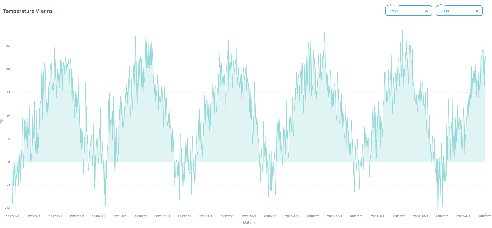

# Temperature Monitor


This is an ETL pipeline which
- pulls live weather data from [openweathermap API](https://https://openweathermap.org/)
- pulls history weather data from a [kaggle dataset](https://www.kaggle.com/sudalairajkumar/daily-temperature-of-major-cities) and loads it into a data warehouse.

## Architecture


The architecture of the application can be divided into 3 components, which are all running in a separate docker container:
1. pipelinerunner: Executes etl_script.py every hour via a cron job and init_temp_data.py on startup.
2. db: measurement and temperature db (both postgres)
3. metabase: dashboard for displaying data

The application was tested and is currently running on an alibaba server instance, running docker and docker compose v1.27.0 on Ubuntu 20.04: [link](http://47.250.133.195:3000/public/question/d09724fa-be6f-444a-a62d-aa8f77cfc7b8?from=1997&to=2008)

## Setup
1. [Docker](https://docs.docker.com/engine/install/) and [Docker Compose](https://docs.docker.com/compose/install/) v1.27.0 or later.
2. [Git](https://git-scm.com/book/en/v2/Getting-Started-Installing-Git).

After installing docker and git, the git repo can be cloned to your computer and all containers can be started by using the command: 
```bash
docker-compose up
```
After successfully starting the docker containers, the dashboard can be accessed on http://localhost:3000
