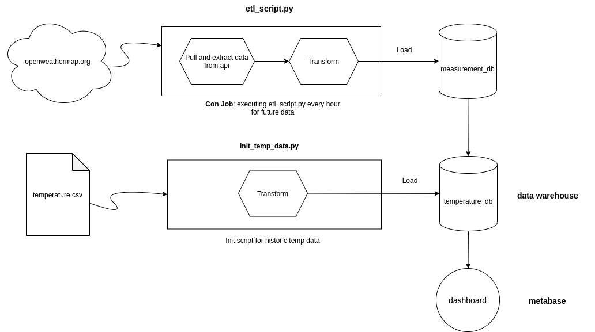

# Weather Monitor

This is an ETL pipeline which
1.) pulls live weather data from [openweathermap API](https://https://openweathermap.org/)
2.) pulls history weather data from a [kaggle dataset](https://www.kaggle.com/sudalairajkumar/daily-temperature-of-major-cities) and loads it into a data warehouse.

## Architecture



The archtiecture of the application can be divided into three components, which are all running in a seperat docker container:
1.) pipelinerunner: Executes etl_script.py every hour via a cron job and init_temp_data.py on startup.
2.) db: measurement and temperature db (both postgres)
3.) metabase: dashboard for displaying data

The application was tested is currently running on a alibaba server instance, running docker and docker compose v1.27.0 on Ubuntu 20.04. 

## Setup
1. [Docker](https://docs.docker.com/engine/install/) and [Docker Compose](https://docs.docker.com/compose/install/) v1.27.0 or later.
2. [git](https://git-scm.com/book/en/v2/Getting-Started-Installing-Git).

After installing docker and git, the git repo can be cloned to your computer and all containers can be startet by using the command: 
```bash
docker-compose up

After succesfully starting the docker containers, the dashboard can be access on http://localhost:3000
